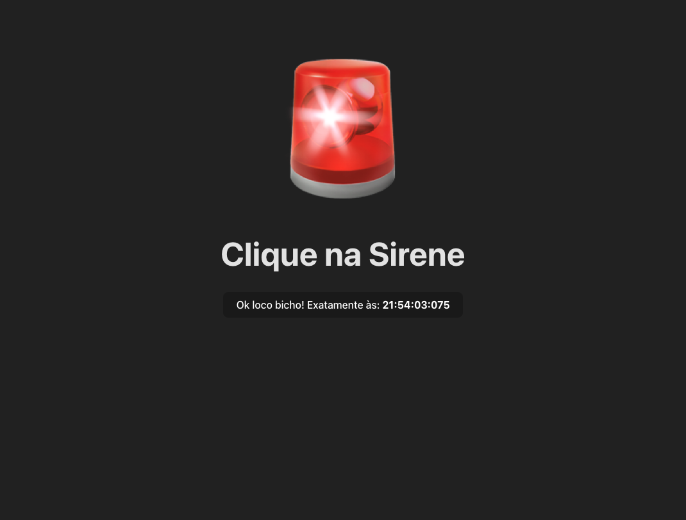

# Passa ou Repassa - Ring Siren App



This application is a digital ring siren designed to facilitate competitive gameplay among multiple participants. It simulates the classic "Passa ou Repassa" game show, allowing users to buzz in quickly to answer questions or perform tasks.

## Technologies Used

-   **React**: `^19.2.0` - A JavaScript library for building user interfaces.
-   **Vite**: `^7.2.4` - A fast frontend build tool that provides an instant development server and lightning-fast HMR.
-   **TypeScript**: `~5.9.3` - A typed superset of JavaScript that compiles to plain JavaScript.
-   **ESLint**: `^9.39.1` - A tool for identifying and reporting on patterns found in ECMAScript/JavaScript code, with the goal of making code more consistent and avoiding bugs.

## Getting Started

To get a local copy up and running, follow these simple steps.

### Prerequisites

Make sure you have Node.js and npm (or yarn) installed.

*   npm
    ```bash
    npm install npm@latest -g
    ```

### Installation

1.  Clone the repository:
    ```bash
    git clone https://github.com/your-username/passa-repassa.git
    ```
2.  Navigate to the project directory:
    ```bash
    cd passa-repassa
    ```
3.  Install dependencies:
    ```bash
    npm install
    ```

### Usage

1.  Start the development server:
    ```bash
    npm run dev
    ```
2.  Open your browser and navigate to the address provided in the terminal (usually `http://localhost:5173`).
3.  Click the siren button to play the sound.


### Check application
You can check the application online on: [https://ring-siren.vercel.app/](https://ring-siren.vercel.app/) 